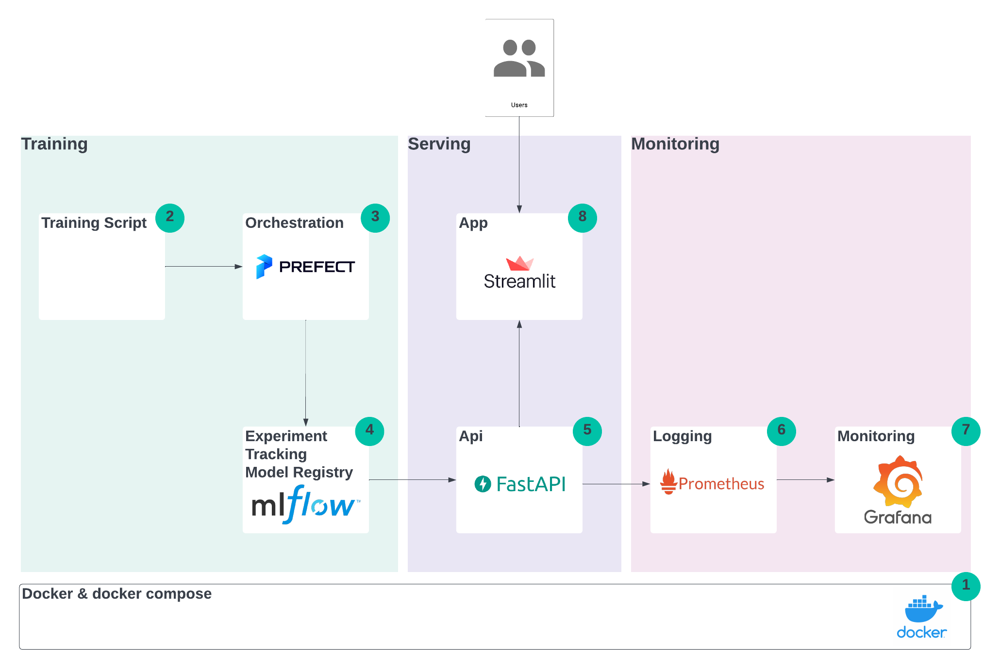

# MLOps Platform Skeleton
This repository contains a simplified MLOps platform (including training, serving and monitoring). The goal of this 
tutorial was to show what individual services do and how they work together.
Therefore, the code was kept to a minimum and everything was bundled in docker compose.
The repo can be used as a skeleton for more advanced project.
 
This project was inspired by the great [MLOps Zoomcamp](https://github.com/DataTalksClub/mlops-zoomcamp). 

## Overview

The full setup consists of three steps:
1) Training - A training script trains a model for the Iris dataset with sklearn, training is orchestrated by prefect and the models metrics and artifacts (the actual models) are uploaded to mlflow. 
2) Serving - The model is pulled and FastAPI delivers the prediction, a streamlit app serves as the user interface.
3) Monitoring - Metrics about the API usage/performance are pushed to Prometheus/Grafana and shown in a dashboard.

The individual services are packaged as docker containers and setup with docker compose.

## How to use
**Prerequisite**: Install Docker (Windows: Docker Desktop)

**Download repository from GitHub**

`git clone https://github.com/dpleus/mlops.git`

**Start docker compose (from project folder)**

`docker composer up`

**Access individual services**

- Prefect `http://localhost:4200`
- mlflow `http://localhost:5000`
- FastAPI (to test) `http://localhost:8086/docs`
- Streamlit UI `http://localhost:8501`
- Grafana Dashboard `http://localhost:3000` Login: admin/admin

**Create example model**

Run deployment in Prefect UI, deploy model artifacts in mlflow, tag it with "production" in mflow.

**Note**: The UI will only work if there is one "production" model in mlflow.

## Services
### 1) Docker and docker compose
`docker-compose.yaml` contains the definitions for all services. 
For every service it contains the docker image (either through `build` if based on a Dockerfile, or through `image` if a remote image). 
Also it opens the relevant ports within your "docker compose network", so that the services can communicate with each other. 
Additionally, a common volume for all containers that use mlflow is created and mounted into `/mlruns`. For Prometheus/Grafana a few configuration files are also mounted.

To initialize all services the command `docker compose up` can be used from the project folder.

### 2+3) Training script and prefect
The training script and prefect (for orchestration) are packaged into one service. 

The **training script** is placed under `training/model_training.py`. It is relatively simple script, it downloads the Iris
dataset and applies a simple RandomForrestClassifier from sklearn. This learning pipeline is not optimized in any form, 
the main goal was to keep it simple. 

The `train` function is wrapped into an `mlflow` flow operator. Also, it uses mlflow autolog.

**prefetc** is an orchestration tool and can therefore be used to schedule, monitor and organize jobs.

Based on the training script, a **prefect deployment file** `train-deployment.yaml` is generated using the following command:

`prefect deployment build training/model_training.py:train` 

The **Dockerfile** ultimately glues these components together. It
1) Creates folders
2) Installs requirements.txt
3) Sets the `PREFECT_API_URL` and `MLFLOW_TRACKING_URI`*
4) Starts the server, pushes the deployment and starts an agent**

*Using docker you can refer to the containers ip using `host.docker.internal` and refer to the other services with their docker compose name, e.g `http://mlflow:5000`

**In this project the prefect server and the agent (who executes the scripts) are on one container.

### 4) FastAPI
**FastAPI** is a framework for high-performance API. In this project I implemented a `/predict` endpoint. If that endpoint is queried
it will download the latest model from mlflow and output the prediction. Additionally, **prometheus_fastapi_instrumentator** scrapes events and sends them to Prometheus.

**Please note**: Currently the script will fetch the first model that is in production. It won't show any error if there is 
no model or there are multiple models.

### 5+6) Prometheus/Grafana
**Prometheus** open source monitoring system. **Grafana** is a dashboarding platform. In short, Prometheus receives the data, while Grafana puts a dashboard on top.
For this project, I used the provided images and just added a few configuration files:

`monitoring/prometheus.yml` - Contains configuration to connect Prometheus to FastAPI

`monitoring/datasource.yml` - Grafana: Datasource configuration

`monitoring/dashboard.json` - Grafana: Dashboard

This part was heavily inspired by https://github.com/Kludex/fastapi-prometheus-grafana
### 7) Streamlit
**Streamlit** is a Python library to rapidly build UIs. The app is very simple and only passes input to the API to retrieve results.

## Limitations
**Multiple host machines: Kubernetes**

This project is meant to be deployed on a single host machine. In practice, you might want to use Kubernetes to deploy it 
on multiple instances to gain more isolation and scalability. **Kompose** could be an option to convert your docker compose file
to Kubernetes yaml. 

**Storage on cloud**

All artifacts, logs, etc. are saved locally/on docker volumes. In practice, you would save them to the cloud.

**Advanced Security**

Security - of course. Authentication, SSL encryption, API authentication and what not.
Good example using nginx. [Example](https://towardsdatascience.com/deploy-mlflow-with-docker-compose-8059f16b6039
)

